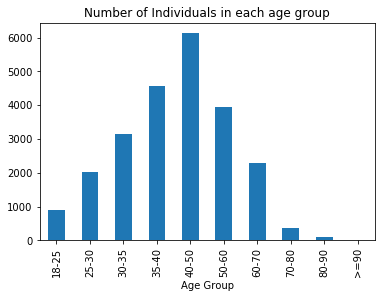

# Data Import

In this script, we use a dataset that represents women's clothing reviews. This script will look at a surface level analysis of the data. We will be predominantly using the the `pandas` data analysis libary.


## Library Load and Data Import
In this section we load our required libraries and data.


```python
import pandas as pd
import matplotlib.pyplot as plt
import numpy as np
```


```python
data_review = pd.read_csv('Womens Clothing E-Commerce Reviews.csv')
```


```python
data_review.shape
```


    (23486, 11)


* The data has 23486 rows and 11 columns.


```python
data_see[['Age']].hist(bins=10)
plt.show()
```


```python
np.mean(data_see.Age)
```


    43.198543813335604


* From the above analysis we see that there are 23486 rows and 11 columns in the available dataset. The average age of the consumer is 43 years of age.

## Function for creating age groups
Instead of using the ages, we will try to group them into buckets. The bucketing function for the same is defined as follows. We will start deep diving into the dataset by asking questions.


```python
def age_group(data_frame):
    '''Function to define the age groups for a dataframe'''
    data_frame.loc[data_frame['Age']<25,'Age Group']   = '18-25'
    data_frame.loc[(data_frame['Age']>=25) & (data_frame['Age']<30),'Age Group']   = '25-30'
    data_frame.loc[(data_frame['Age']>=30) & (data_frame['Age']<35),'Age Group']   = '30-35'
    data_frame.loc[(data_frame['Age']>=35) & (data_frame['Age']<40),'Age Group']   = '35-40'
    data_frame.loc[(data_frame['Age']>=40) & (data_frame['Age']<50),'Age Group']   = '40-50'
    data_frame.loc[(data_frame['Age']>=50) & (data_frame['Age']<60),'Age Group']   = '50-60'
    data_frame.loc[(data_frame['Age']>=60) & (data_frame['Age']<70),'Age Group']   = '60-70'
    data_frame.loc[(data_frame['Age']>=70) & (data_frame['Age']<80),'Age Group']   = '70-80'
    data_frame.loc[(data_frame['Age']>=80) & (data_frame['Age']<90),'Age Group']   = '80-90'
    data_frame.loc[(data_frame['Age']>=90),'Age Group']   = '>=90'
    return data_frame

```

# Basic Analysis
## How many individuals are there for each division type and rating?


```python
division_name_rating = data_review.groupby(['Division Name','Rating']).size().reset_index()
division_name_rating.columns = ['Division Name','Rating','Occurence']
```


```python
division_name_rating.pivot(index='Division Name',columns='Rating',values='Occurence').reset_index().plot(kind='bar',x='Division Name')
plt.show()
```


*  A majority of users purchased general wear.
*  A majority of users gave high ratings

## How many individuals are there in each age group?


```python
# generally how does each age group vote?

data_age_rating = data_review[['Age','Rating']].groupby(['Age','Rating']).size().reset_index()
data_age_rating.columns 
data_age_rating = age_group(data_age_rating)

```


```python
data_age_rating.columns = ['Age','Rating','Freq','Age Group'] 
```


```python
data_age_group_freq= data_age_rating.groupby('Age Group').agg({'Freq':np.sum}).reset_index()
data_age_group_freq.columns = ['Age Group','Freq']
data_age_group_freq.plot(kind='bar',x='Age Group',y='Freq',title='Number of Individuals in each age group')
plt.legend().remove()

plt.show()
```





A majority of individuals are between 40 and 50 years old.

## On average how did each age group vote?


```python
# How did each age group vote on average?
data_age_rating['Total Rating'] = data_age_rating['Rating']*data_age_rating['Freq']
data_age_group_rating=data_age_rating.groupby('Age Group').agg({'Total Rating':np.sum,'Freq':np.sum}).reset_index()
data_age_group_rating['avg']= data_age_group_rating['Total Rating']/data_age_group_rating['Freq']
data_age_group_rating.plot(kind='bar',x='Age Group',y='avg')
plt.legend().remove()
plt.show()

    
    
```


* There is not much variation in the average ratings given by each age group.

## How does the ratings vary across ages?


```python
# Variation in the ratings across ages
data_age_rating_variation = data_review[['Age','Rating']]
data_age_rating_variation = age_group(data_age_rating_variation)
```

    /Users/padhokshaja/anaconda/lib/python3.6/site-packages/pandas/core/indexing.py:337: SettingWithCopyWarning: 
    A value is trying to be set on a copy of a slice from a DataFrame.
    Try using .loc[row_indexer,col_indexer] = value instead
    
    See the caveats in the documentation: http://pandas.pydata.org/pandas-docs/stable/indexing.html#indexing-view-versus-copy
      self.obj[key] = _infer_fill_value(value)
    /Users/padhokshaja/anaconda/lib/python3.6/site-packages/pandas/core/indexing.py:517: SettingWithCopyWarning: 
    A value is trying to be set on a copy of a slice from a DataFrame.
    Try using .loc[row_indexer,col_indexer] = value instead
    
    See the caveats in the documentation: http://pandas.pydata.org/pandas-docs/stable/indexing.html#indexing-view-versus-copy
      self.obj[item] = s


```python

data_age_rating_variation = data_age_rating_variation.drop('Age',axis=1)
data_age_rating_variation.boxplot(by='Age Group',figsize=(20,10))
plt.xticks(rotation=90)
plt.show()
```


* Individuals from the ages 30 to 35 had a large amount of variation in the ratings they gave.

## Variation of ratings across various types of product


```python
division_name_rating= data_review[['Rating','Class Name']]
division_name_rating.boxplot(by='Class Name',figsize=(20,10))
plt.xticks(rotation=90)

plt.show()

```


```python
division_name_rating.groupby('Class Name').agg({'Rating':np.mean}).reset_index().plot(kind='bar',x='Class Name',y='Rating')
plt.show()
```


* Trendy attire have a large variance compared to other types of attire


```python
# How do ratings vary for each age group across Classes of products?

data_product_rating_box = data_see[['Class Name','Age','Rating']]

from pylab import plot, show, savefig, xlim, figure,hold, ylim, legend, boxplot, setp, axes

##creating the age group variable

data_product_rating_box = age_group(data_product_rating_box)
```

    /Users/padhokshaja/anaconda/lib/python3.6/site-packages/pandas/core/indexing.py:337: SettingWithCopyWarning: 
    A value is trying to be set on a copy of a slice from a DataFrame.
    Try using .loc[row_indexer,col_indexer] = value instead
    
    See the caveats in the documentation: http://pandas.pydata.org/pandas-docs/stable/indexing.html#indexing-view-versus-copy
      self.obj[key] = _infer_fill_value(value)
    /Users/padhokshaja/anaconda/lib/python3.6/site-packages/pandas/core/indexing.py:517: SettingWithCopyWarning: 
    A value is trying to be set on a copy of a slice from a DataFrame.
    Try using .loc[row_indexer,col_indexer] = value instead
    
    See the caveats in the documentation: http://pandas.pydata.org/pandas-docs/stable/indexing.html#indexing-view-versus-copy
      self.obj[item] = s


```python


for i in list(pd.unique(data_product_rating_box[['Age Group']].values.ravel('K'))):
    data_product_rating_box_i = data_product_rating_box.loc[data_product_rating_box['Age Group']==i,]
    data_product_rating_box_i.drop('Age',axis=1,inplace=True)
    data_product_rating_box_i.boxplot(by='Class Name',figsize=(10,10))
    plt.title('Ratings Distribution by Product for Age Groups '+i)
    plt.xticks(rotation=90)
    plt.suptitle('')
    plt.show()
    

    
```

    /Users/padhokshaja/anaconda/lib/python3.6/site-packages/ipykernel_launcher.py:5: SettingWithCopyWarning: 
    A value is trying to be set on a copy of a slice from a DataFrame
    
    See the caveats in the documentation: http://pandas.pydata.org/pandas-docs/stable/indexing.html#indexing-view-versus-copy
      """


* For all age groups apart from 35-40 and 80-90, the median ratings score for trendy clothes have remain low.
* Jeans have a high median score for all age groups, except for 80-90.
* Blouses dipped in median scores for the age group *18-25* and *30-35*
* Median rating of swim wear dips for the age group *60-70* ,*40-50* and *70-80*


```python
# QUESTIONS THAT NEED TO BE ANSWERED
## VARIATION IN THE RATINGS BY AGE / PRODUCT TYPE?(done)
## MOST IMPORTANT WORDS USED FOR EACH PRODUCT TYPE
## AGE GROUP WISE AVERAGE SENTIMENT SCORE
```

# Sentiment Scores

## Distribution of Sentiment scores across product types and age groups


```python
from afinn import Afinn
afinn = Afinn()
data_review_text_product = data_review[['Review Text','Class Name','Age']]
data_review_text_product['Review Text']= data_review_text_product['Review Text'].astype(str)
data_review_text_product = age_group(data_review_text_product)


data_review_text_product['sent_score'] = data_review_text_product.apply(lambda row: afinn.score(row['Review Text']), axis=1)

#data_review_text_product.drop('Age',axis=1,inplace=True)
```

    /Users/padhokshaja/anaconda/lib/python3.6/site-packages/ipykernel_launcher.py:4: SettingWithCopyWarning: 
    A value is trying to be set on a copy of a slice from a DataFrame.
    Try using .loc[row_indexer,col_indexer] = value instead
    
    See the caveats in the documentation: http://pandas.pydata.org/pandas-docs/stable/indexing.html#indexing-view-versus-copy
      after removing the cwd from sys.path.
    /Users/padhokshaja/anaconda/lib/python3.6/site-packages/pandas/core/indexing.py:337: SettingWithCopyWarning: 
    A value is trying to be set on a copy of a slice from a DataFrame.
    Try using .loc[row_indexer,col_indexer] = value instead
    
    See the caveats in the documentation: http://pandas.pydata.org/pandas-docs/stable/indexing.html#indexing-view-versus-copy
      self.obj[key] = _infer_fill_value(value)
    /Users/padhokshaja/anaconda/lib/python3.6/site-packages/pandas/core/indexing.py:517: SettingWithCopyWarning: 
    A value is trying to be set on a copy of a slice from a DataFrame.
    Try using .loc[row_indexer,col_indexer] = value instead
    
    See the caveats in the documentation: http://pandas.pydata.org/pandas-docs/stable/indexing.html#indexing-view-versus-copy
      self.obj[item] = s
    /Users/padhokshaja/anaconda/lib/python3.6/site-packages/ipykernel_launcher.py:8: SettingWithCopyWarning: 
    A value is trying to be set on a copy of a slice from a DataFrame.
    Try using .loc[row_indexer,col_indexer] = value instead
    
    See the caveats in the documentation: http://pandas.pydata.org/pandas-docs/stable/indexing.html#indexing-view-versus-copy
      


```python
for i in list(pd.unique(data_review_text_product['Age Group'].values.ravel('K'))):
    data_review_text_product_i = data_review_text_product.loc[data_review_text_product['Age Group']==i,]
    data_review_text_product_i.drop('Age',axis=1,inplace=True)
    data_review_text_product_i.boxplot(by='Class Name',figsize=(10,10))
    plt.title('Sentiment Distribution by Product for Age Groups '+i)
    plt.xticks(rotation=90)
    plt.suptitle('')
    plt.show()

```

    /Users/padhokshaja/anaconda/lib/python3.6/site-packages/ipykernel_launcher.py:3: SettingWithCopyWarning: 
    A value is trying to be set on a copy of a slice from a DataFrame
    
    See the caveats in the documentation: http://pandas.pydata.org/pandas-docs/stable/indexing.html#indexing-view-versus-copy
      This is separate from the ipykernel package so we can avoid doing imports until


* Trendy clothes are viewed highly by individuals from ages 30 to 35.
* Intimate wear and Outerwear is viewed positively by individuals aged between 18 to 25.
* For individuals between ages 80 to 90 , knitwear and fine gauge wear were viewed positively.


# Conclusion

* A majority of consumers seem to have votes positively.
* Tastes in clothes change by age. For example trendy cloth wear had a higher median rating by individuals between 30 to 35 years of age where as knit wear were more preferred by individuals who are between the ages of 80 to 90


# Further Analysis

* The data can be further analysed by 
    * Creating a wordcloud of the review text for each product type.
    * Analysing the most important words derived from the review text for each product.
    * Segmentation of consumers using clustering algorithms

